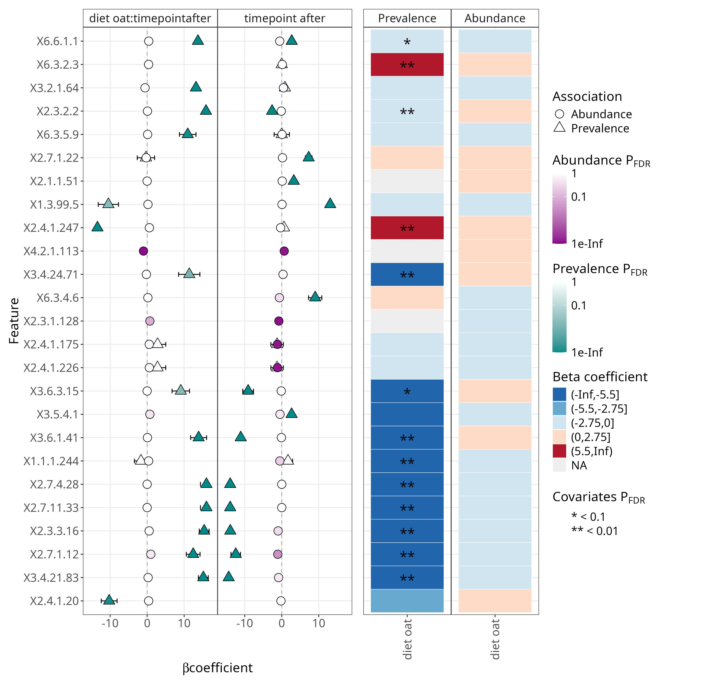

### Differential abundance analysis

```{r setup}
library(maaslin3)

source("../funct.R")
# Load the TreeSummarizedExperiment object
tse <- readRDS("../../data/tse.Rds")

metacyc_tse <- altExp(tse, "metacyc")

variable <- "diet" 
formula_used <- "~ diet * timepoint + (1 | id)"
```

-   Group variable: **`r variable`**
-   Formula used: **`r formula_used`**

```{r data_prep}
# Create output directory for results
output_base_dir <- "../../output/daa/daa_mtc"
dir.create(output_base_dir, showWarnings = FALSE)
# Keep paired cases that have both time points
paired.cases <- names(which(table(colData(metacyc_tse)$id) == 2))
metacyc_tse <- metacyc_tse[, metacyc_tse$id %in% paired.cases]
```

```{r maaslin all}
# Run Maaslin3
run_maaslin3 <- function(metacyc_tse) {
  # Keep only paired cases (individuals with both time points)
  paired.cases <- names(which(table(colData(metacyc_tse)$id) == 2))
  metacyc_tse <- metacyc_tse[, metacyc_tse$id %in% paired.cases]

  # Create output directory for this taxonomic level
  output_dir <- file.path(output_base_dir)
  dir.create(output_dir, showWarnings = FALSE)

  # Run MaAsLin3
  maaslin3(
    metacyc_tse,
    output = output_dir,
    formula = '~ diet * timepoint + (1 | id)',
    normalization = 'TSS',
    transform = 'LOG',
    augment = TRUE,
    standardize = FALSE,
    median_comparison_abundance = FALSE,
    median_comparison_prevalence = FALSE,
    max_pngs = 100,
    verbosity = "WARN"
  )
}
```

```{r print_table}
#| label: table-of-significant-results

file_path <- file.path("../../output/daa/daa_mtc/significant_results.tsv")
total_features <- nrow(metacyc_tse)

# Run Maaslin3 only if the file doesn't exist
if (!file.exists(file_path)) {
run_maaslin3(metacyc_tse)
}

 if (file.exists(file_path)) {
    daa_tab <- read_tsv(file_path, col_names = TRUE)
    daa_tab <- daa_tab %>%
        filter(!is.na(feature)) %>%
        select(feature, metadata, value, coef, qval_individual, qval_joint, model)
    if (knitr::is_html_output()) {
      datatable(
          daa_tab,
          options = list(
            pageLength = 6,
            dom = 'Bfrtip'
          ),
          caption = "Table of significant features",
          rownames = FALSE
      ) %>%
        formatSignif(columns = c("qval_joint", "qval_individual", "coef"), digits = 3)
    } else {
      library(kableExtra)
      daa_tab %>% 
        mutate(
          across(where(is.numeric), ~round(., 3)),
          feature = ifelse(nchar(feature) > 8, 
                         paste0(substr(feature, 1, 8), "..."), 
                         feature)
          #p.adj = signif(p.adj, 3)
        ) %>%
        kbl(caption = "Table of significant features",
            booktabs = TRUE,
            longtable = TRUE,
            align = c('l', 'r', 'r', 'r', 'r', 'r', 'r')) %>%
        kable_styling(latex_options = "repeat_header") %>%
        row_spec(0, bold = TRUE)
    }
} else {
    return(NULL)
  }

```

```{r print results}
png_files <- list.files(output_base_dir, pattern = "\\.png$", full.names = TRUE, recursive = TRUE)
```


```{r}
image_paths <- c(
  "../../output/daa/daa_mtc/figures/association_plots/diet/linear/diet_X2.3.1.128_linear.png",
  "../../output/daa/daa_mtc/figures/association_plots/diet/linear/diet_X3.1.1.23_linear.png",
  "../../output/daa/daa_mtc/figures/association_plots/diet/linear/diet_X3.1.2.12_linear.png",
  "../../output/daa/daa_mtc/figures/association_plots/diet/linear/diet_X4.2.1.113_linear.png",
  "../../output/daa/daa_mtc/figures/association_plots/diet/linear/diet_X5.1.3.32_linear.png",
  "../../output/daa/daa_mtc/figures/association_plots/diet/linear/diet_X6.2.1.30_linear.png",
  "../../output/daa/daa_mtc/figures/association_plots/diet/logistic/diet_X1.1.1.244_logistic.png",
  "../../output/daa/daa_mtc/figures/association_plots/diet/logistic/diet_X1.2.7.3_logistic.png",
  "../../output/daa/daa_mtc/figures/association_plots/diet/logistic/diet_X1.3.99.5_logistic.png",
  "../../output/daa/daa_mtc/figures/association_plots/diet/logistic/diet_X2.3.1.86_logistic.png",
  "../../output/daa/daa_mtc/figures/association_plots/diet/logistic/diet_X2.3.2.2_logistic.png",
  "../../output/daa/daa_mtc/figures/association_plots/diet/logistic/diet_X2.3.3.16_logistic.png",
  "../../output/daa/daa_mtc/figures/association_plots/diet/logistic/diet_X2.4.1.20_logistic.png",
  "../../output/daa/daa_mtc/figures/association_plots/diet/logistic/diet_X2.4.1.247_logistic.png",
  "../../output/daa/daa_mtc/figures/association_plots/diet/logistic/diet_X2.7.1.12_logistic.png",
  "../../output/daa/daa_mtc/figures/association_plots/timepoint/linear/timepoint_X1.1.1.276_linear.png",
  "../../output/daa/daa_mtc/figures/association_plots/timepoint/linear/timepoint_X1.1.1.79_linear.png",
  "../../output/daa/daa_mtc/figures/association_plots/timepoint/linear/timepoint_X1.17.1.2_linear.png",
  "../../output/daa/daa_mtc/figures/association_plots/timepoint/linear/timepoint_X1.2.1.50_linear.png",
  "../../output/daa/daa_mtc/figures/association_plots/timepoint/linear/timepoint_X1.4.1.16_linear.png",
  "../../output/daa/daa_mtc/figures/association_plots/timepoint/linear/timepoint_X2.1.1.52_linear.png",
  "../../output/daa/daa_mtc/figures/association_plots/timepoint/linear/timepoint_X2.3.1.128_linear.png",
  "../../output/daa/daa_mtc/figures/association_plots/timepoint/linear/timepoint_X2.3.1.38_linear.png",
  "../../output/daa/daa_mtc/figures/association_plots/timepoint/linear/timepoint_X2.4.1.175_linear.png",
  "../../output/daa/daa_mtc/figures/association_plots/timepoint/linear/timepoint_X2.4.1.226_linear.png",
  "../../output/daa/daa_mtc/figures/association_plots/timepoint/linear/timepoint_X2.6.1.17_linear.png",
  "../../output/daa/daa_mtc/figures/association_plots/timepoint/linear/timepoint_X2.6.1.2_linear.png",
  "../../output/daa/daa_mtc/figures/association_plots/timepoint/linear/timepoint_X2.6.1.85_linear.png",
  "../../output/daa/daa_mtc/figures/association_plots/timepoint/linear/timepoint_X2.7.1.105_linear.png",
  "../../output/daa/daa_mtc/figures/association_plots/timepoint/logistic/timepoint_X1.3.99.5_logistic.png",
  "../../output/daa/daa_mtc/figures/association_plots/timepoint/logistic/timepoint_X2.1.1.51_logistic.png",
  "../../output/daa/daa_mtc/figures/association_plots/timepoint/logistic/timepoint_X2.3.2.2_logistic.png",
  "../../output/daa/daa_mtc/figures/association_plots/timepoint/logistic/timepoint_X2.3.3.16_logistic.png",
  "../../output/daa/daa_mtc/figures/association_plots/timepoint/logistic/timepoint_X2.7.1.12_logistic.png",
  "../../output/daa/daa_mtc/figures/association_plots/timepoint/logistic/timepoint_X2.7.1.172_logistic.png",
  "../../output/daa/daa_mtc/figures/association_plots/timepoint/logistic/timepoint_X2.7.1.22_logistic.png",
  "../../output/daa/daa_mtc/figures/association_plots/timepoint/logistic/timepoint_X2.7.11.33_logistic.png",
  "../../output/daa/daa_mtc/figures/association_plots/timepoint/logistic/timepoint_X2.7.4.28_logistic.png",
  "../../output/daa/daa_mtc/figures/association_plots/timepoint/logistic/timepoint_X3.13.1.1_logistic.png",
  "../../output/daa/daa_mtc/figures/association_plots/timepoint/logistic/timepoint_X3.4.21.83_logistic.png",
  "../../output/daa/daa_mtc/figures/association_plots/timepoint/logistic/timepoint_X3.5.1.49_logistic.png",
  "../../output/daa/daa_mtc/figures/association_plots/timepoint/logistic/timepoint_X3.5.4.1_logistic.png",
  "../../output/daa/daa_mtc/figures/association_plots/timepoint/logistic/timepoint_X3.6.1.41_logistic.png",
  "../../output/daa/daa_mtc/figures/association_plots/timepoint/logistic/timepoint_X3.6.3.15_logistic.png",
  "../../output/daa/daa_mtc/figures/association_plots/timepoint/logistic/timepoint_X6.3.4.6_logistic.png",
  "../../output/daa/daa_mtc/figures/association_plots/timepoint/logistic/timepoint_X6.6.1.1_logistic.png"
)

# Convert to a matrix with 4 columns (fills row-wise)
image_matrix <- matrix(image_paths, ncol = 4, byrow = TRUE)

# Print as a kable table
kable(image_matrix, format = "markdown", escape = FALSE)

```

