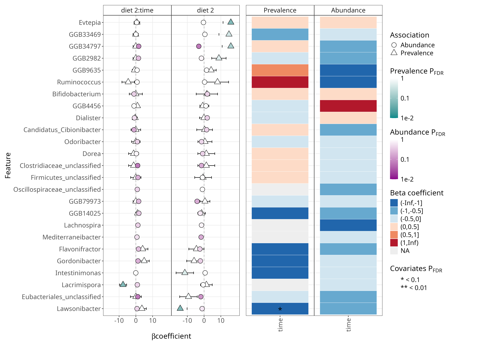
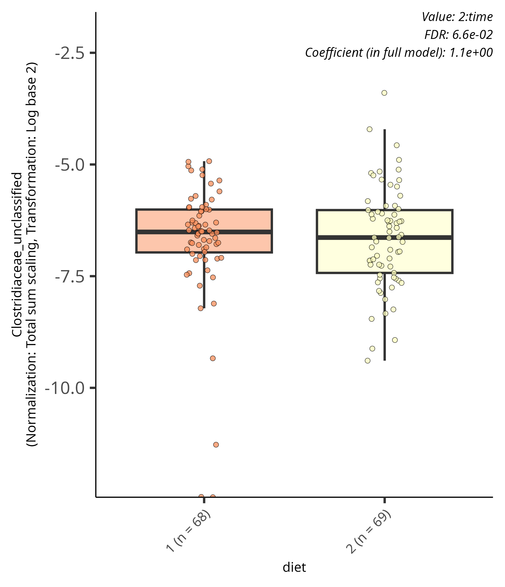
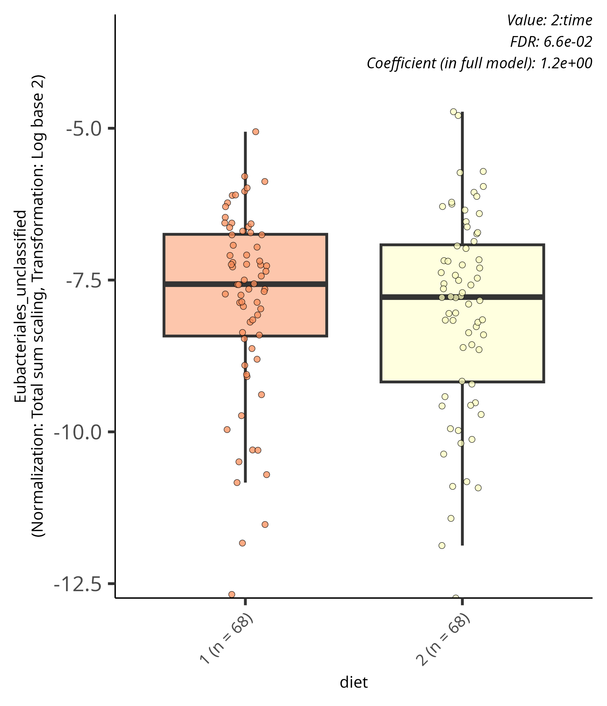
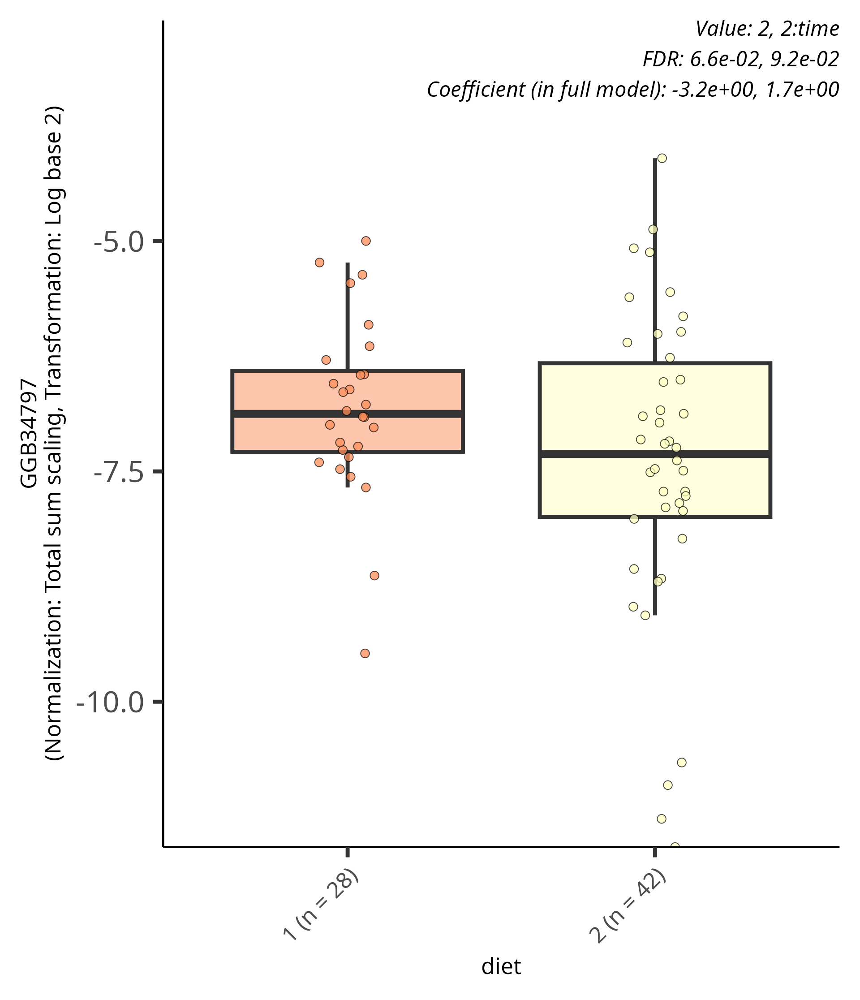
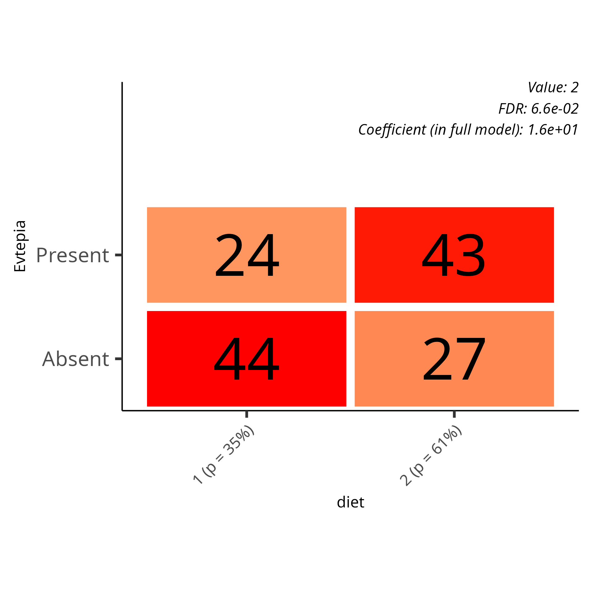
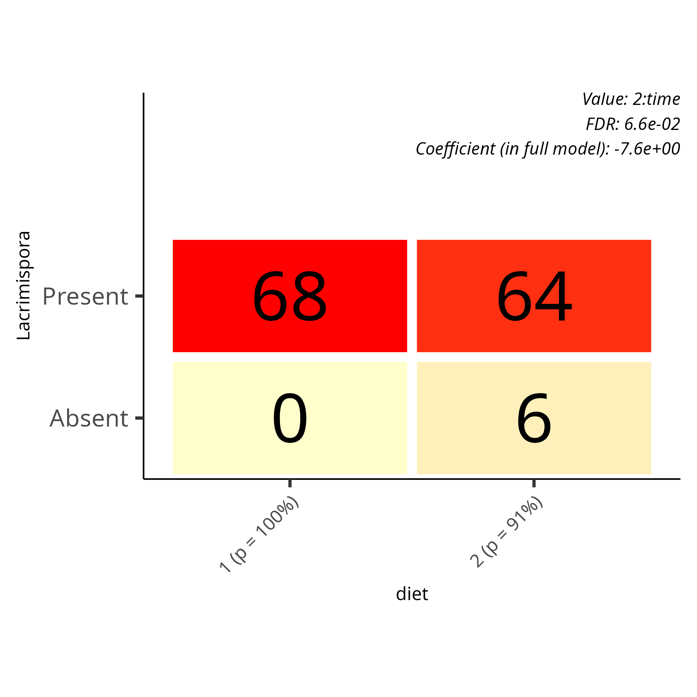

### Differential abundance analysis

```{r setup}
library(maaslin3)

source("../funct.R")
# Load the TreeSummarizedExperiment object
tse <- readRDS("../../data/tse.Rds")

taxa_tse <- altExp(tse, "genus_prevalent")

variable <- "diet" 
formula_used <- "~ diet * time + (1 | id)"
```

-   Group variable: **`r variable`**
-   Formula used: **`r formula_used`**

```{r data_prep}
# Create output directory for results
output_base_dir <- "../../output/daa/daa_taxa"
dir.create(output_base_dir, showWarnings = FALSE)
# Keep paired cases that have both time points
paired.cases <- names(which(table(colData(taxa_tse)$id) == 2))
taxa_tse <- taxa_tse[, taxa_tse$id %in% paired.cases]
```

```{r maaslin all}
# Run Maaslin3
# fit_out <- maaslin3(
#   taxa_tse,
#   output = output_base_dir,
#   formula = '~ diet * time + (1 | id)',
#   normalization = 'TSS',
#   transform = 'LOG',
#   augment = TRUE,
#   standardize = FALSE,
#   median_comparison_abundance = FALSE,
#   median_comparison_prevalence = FALSE,
#   max_pngs = 100,
#   verbosity = "WARN"
# )
```

```{r print_table}
#| label: table-of-significant-results
daa_tab <- read_tsv("../../output/daa/daa_taxa/significant_results.tsv", col_names = TRUE)
daa_tab <- daa_tab %>%
    filter(!is.na(feature)) %>%
    select(feature, metadata, value, coef, qval_individual, qval_joint, model)
if (knitr::is_html_output()) {
  datatable(
      daa_tab,
      options = list(
        pageLength = 6,
        dom = 'Bfrtip'
      ),
      caption = "Table of significant features",
      rownames = FALSE
  ) %>%
    formatSignif(columns = c("qval_joint"), digits = 3)
} else {
  library(kableExtra)
  daa_tab %>% 
    mutate(
      across(where(is.numeric), ~round(., 3))
      # feature = ifelse(nchar(feature) > 8, 
      #                paste0(substr(feature, 1, 8), "..."), 
      #                feature)
      #p.adj = signif(p.adj, 3)
    ) %>%
    kbl(caption = "Table of significant features",
        booktabs = TRUE,
        longtable = TRUE,
        align = c('l', 'r', 'r', 'r', 'r', 'r', 'r')) %>%
    kable_styling(latex_options = "repeat_header") %>%
    row_spec(0, bold = TRUE)
}

```

```{r print results}
# png_files <- list.files(output_base_dir, pattern = "\\.png$", full.names = TRUE, recursive = TRUE)
```

   

   
