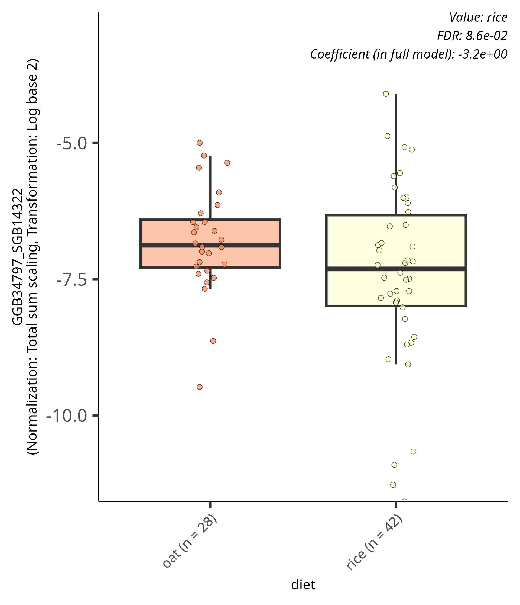
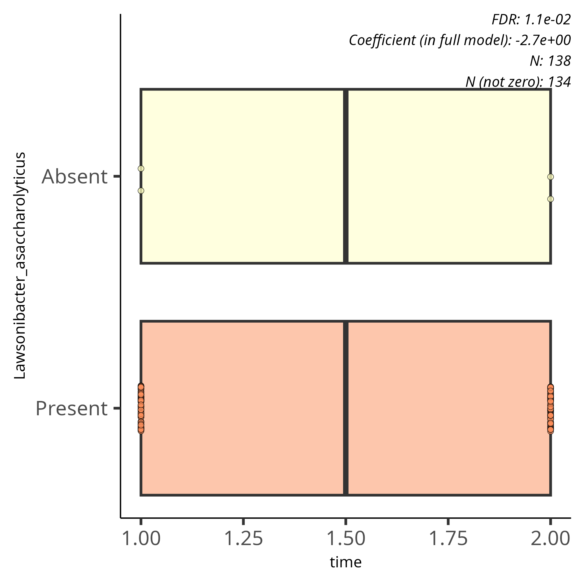
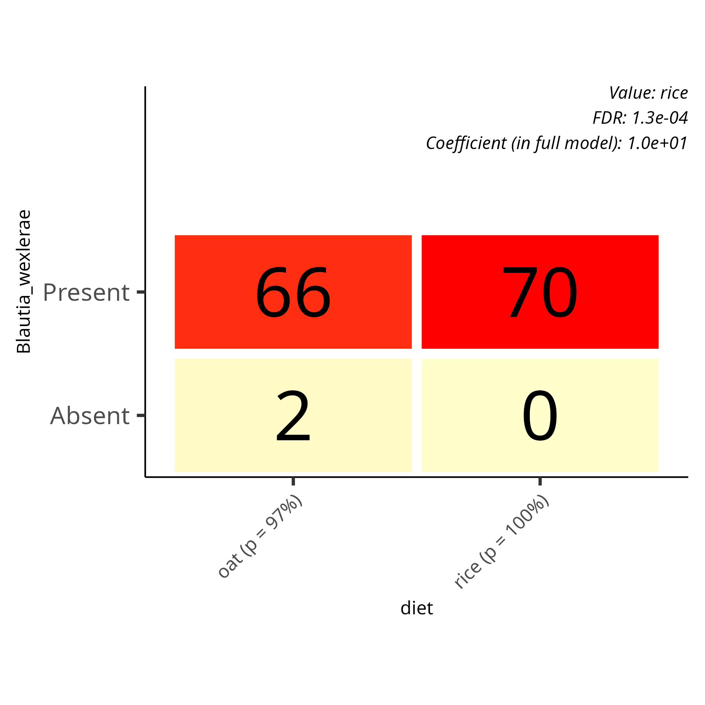
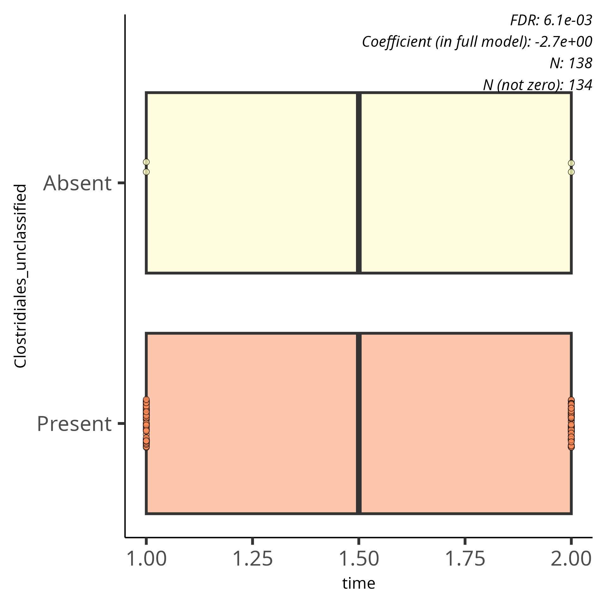
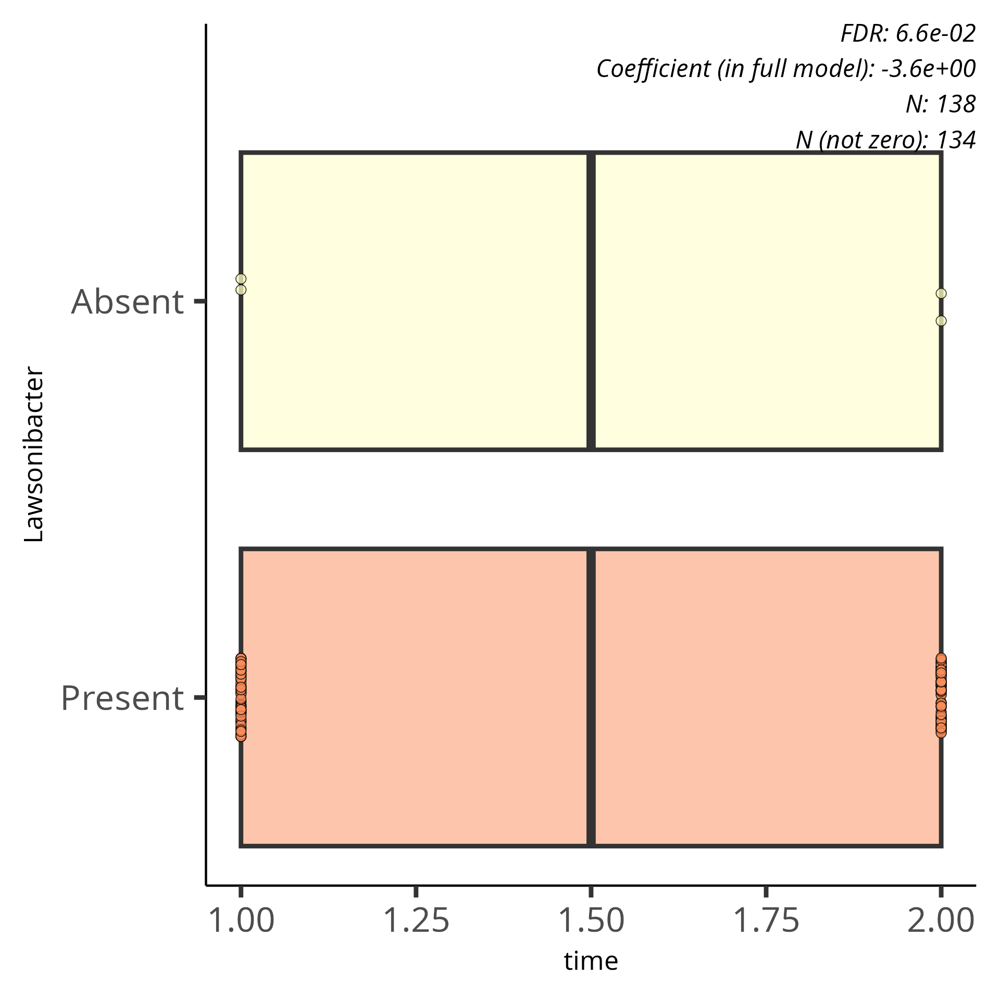
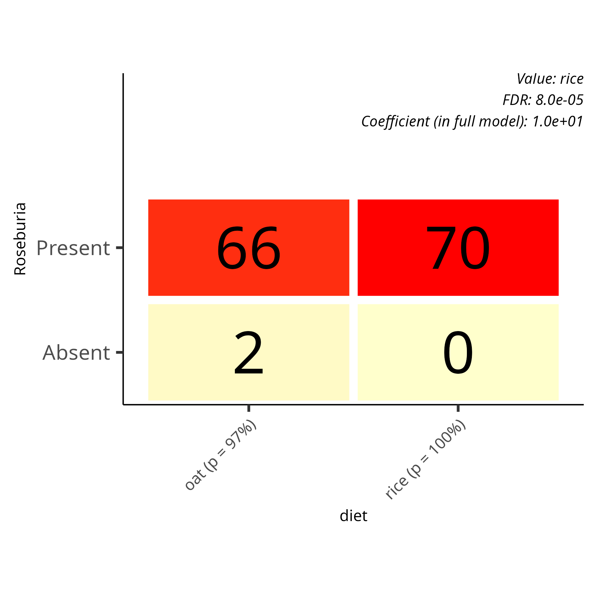

# Differential abundance analysis

```{r setup}
library(maaslin3)

source("../funct.R")
# Load the TreeSummarizedExperiment object
tse <- readRDS("../../data/tse.Rds")
taxa_levels <- c("species","genus", "family", "phylum")

prevalence.th <- 10/100
detection.th <- 0.1/100

variable <- "diet" 
formula_used <- "~ diet * time + (1 | id)"
correction <- "Benjamini-Hochberg FDR adjustment"
```

Analysis information:

-   Method: maaslin3
-   Taxonomic level: `r taxa_levels`
-   Group variable: `r variable`
-   Formula used: **`r formula_used`**
-   Correction: **`r correction`**
-   Detection threshold: `r 100 * detection.th`%
-   Prevalence threshold: `r 100 * prevalence.th`%

```{r data_prep}
# Create output directory for results
output_base_dir <- "../../output/daa/daa_taxa"
dir.create(output_base_dir, showWarnings = FALSE)
```

```{r maaslin all}
# Run Maaslin3
run_maaslin3 <- function(taxa_tse, taxa_name) {
  # Keep only paired cases (individuals with both time points)
  paired.cases <- names(which(table(colData(taxa_tse)$id) == 2))
  taxa_tse <- taxa_tse[, taxa_tse$id %in% paired.cases]

  # Create output directory for this taxonomic level
  output_dir <- file.path(output_base_dir, taxa_name)
  dir.create(output_dir, showWarnings = FALSE)

  # Run MaAsLin3
  maaslin3(
    taxa_tse,
    output = output_dir,
    formula = '~ diet * time + (1 | id)',
    normalization = 'TSS',
    transform = 'LOG',
    augment = TRUE,
    standardize = FALSE,
    median_comparison_abundance = FALSE,
    median_comparison_prevalence = FALSE,
    max_pngs = 100,
    verbosity = "WARN"
  )
}
```


For a complete table of maaslin3 results, see [Species](https://github.com/openresearchlabs/OGB_project/blob/main/output/daa/daa_taxa/species/all_results.tsv), [genus](https://github.com/openresearchlabs/OGB_project/blob/main/output/daa/daa_taxa/genus/all_results.tsv), [phylum](https://github.com/openresearchlabs/OGB_project/blob/main/output/daa/daa_taxa/phylum/all_results.tsv), [family](https://github.com/openresearchlabs/OGB_project/blob/main/output/daa/daa_taxa/family/all_results.tsv)

The following tables lists all associations that pass MaAsLin 3's significance threshold for joint or individual q-values, ordered by increasing individual q-value.


```{r print_table}
#| label: table-of-significant-results
#| results: 'asis'
tab_res <- lapply(taxa_levels, function(taxa_name) {
  taxa_tse <- altExp(tse, paste0(taxa_name, "_prevalent"))
  file_path <- file.path("../../output/daa/daa_taxa", taxa_name, "significant_results.tsv")
  total_features <- nrow(taxa_tse)
  
  # Run Maaslin3 only if the file doesn't exist
  if (!file.exists(file_path)) {
    run_maaslin3(taxa_tse, taxa_name)
  }
  
  # Process significant results if the file exists
  if (file.exists(file_path)) {
    daa_tab <- read_tsv(file_path, col_names = TRUE, show_col_types = FALSE) %>%
      filter(!is.na(feature)) %>%
      select(feature, metadata, value, coef, qval_individual, qval_joint, model)
    
    table_caption <- paste("Table of significant features for", taxa_name, 
                           "- Total features analyzed:", total_features)
    
    # Split the results by model
    daa_tab_split <- split(daa_tab, daa_tab$model)
    
    # Format output for HTML or LaTeX
    if (knitr::is_html_output()) {
      lapply(daa_tab_split, function(df) {
        datatable(
          df,
          options = list(pageLength = 6, dom = 'Bfrtip'),
          caption = table_caption,
          rownames = FALSE
        ) %>%
        formatSignif(columns = c("qval_joint", "qval_individual", "coef"), digits = 3)
      })
    } else {
      lapply(daa_tab_split, function(df) {
        df %>%
          mutate(across(where(is.numeric), ~round(., 3))) %>%
          kbl(
            caption = paste(table_caption, "- Model:", unique(df$model)),
            booktabs = TRUE,
            longtable = TRUE,
            align = c('l', 'r', 'r', 'r', 'r', 'r', 'r')
          ) %>%
          kable_styling(latex_options = "repeat_header") %>%
          row_spec(0, bold = TRUE)
      })
    }
  } else {
    return(NULL)
  }
})
species_tab <- tab_res[[1]]
genus_tab <- tab_res[[2]]
phylum_tab <- tab_res[[3]]
family_tab <- tab_res[[4]]

species_tab[["abundance"]]
species_tab[["prevalence"]]

genus_tab[["abundance"]]
genus_tab[["prevalence"]]

phylum_tab[["abundance"]]
phylum_tab[["prevalence"]]
# 
# family_tab[["abundance"]]
# family_tab[["prevalence"]]
```

```{r print results}
# png_files <- list.files(output_base_dir, pattern = "\\.png$", full.names = TRUE, recursive = TRUE)
```

## Summary plots

This plots contain a combined coefficient plot and heatmap of the most significant association between microbial features (listed on the y-axis) and different dietary conditions over time.

The coef plot shows the estimated effect sizes (β coefficients) for different microbial features.

-   Circles (○) represent associations based on abundance.
-   Triangles (△) represent associations based on prevalence.

The purple color represents the significance level (FDR-adjusted p-value) for abundance. The teal color represents the significance level (FDR-adjusted p-value) for prevalence.Darker colors indicate more significant associations.Error bars show uncertainty in the estimates.

The heatmap summarizes how different microbes are affected. Blue/Red coloring represents the effect sizes:

-   Dark blue: Strong negative association.
-   Light blue: Weak negative association.
-   Light red: Weak positive association.
-   Dark red: Strong positive association.
-   Gray (NA): No data.

Asterisks (*) indicate significant associations: -* (p \< 0.1) - \*\* (p \< 0.01)

### species


### family

\

### genus

\

### phylum

\

## Associations plots

Box plots are used for categorical data abundance associations. Grids are used for categorical data prevalence associations. Data points plotted are after filtering, normalization, and transformation so that the scale in the plot is the scale that was used in fitting.

### Associations-species

\
\
\


### Associations-family

\
\

### Associations-genus

\
\
\
\
\

