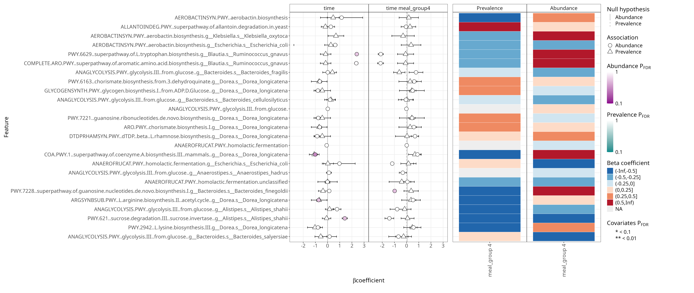

### Differential abundance analysis

```{r setup}
library(maaslin3)

# Source group-assignment
source("funct.R")

# Load the TreeSummarizedExperiment object
tse <- readRDS("../data/tse.Rds")

path_tse <- altExp(tse, "pathabundance")

variable <- "meal_group" 
formula_used <- "~ time * meal_group"
```

-   Group variable: **`r variable`**
-   Formula used: **`r formula_used`**

```{r data_prep}
# Create output directory for results
# output_base_dir <- "../output/daa_maaslin3"
# dir.create(output_base_dir, showWarnings = FALSE)
```

```{r maaslin all}
# Extract unique diets from path_tse$diet
# unique_diets <- sort(unique(path_tse$diet))
# 
# # Run Maaslin3 for each diet and save results
# results <- lapply(unique_diets, function(diet) {
#   # Subset path_tse for the current diet
#   diet_tse <- path_tse[, path_tse$diet == diet]
#   
#   # Define the output directory for the current diet
#   diet_output_dir <- file.path(output_base_dir, paste0("diet_", diet))
#   dir.create(diet_output_dir, showWarnings = FALSE)
#   
#   # Run Maaslin3
#   fit_out <- maaslin3(
#     diet_tse,
#     output = diet_output_dir,
#     formula = '~ time * meal_group',
#     normalization = 'TSS',
#     transform = 'LOG',
#     augment = TRUE,
#     standardize = TRUE,
#     max_significance = 0.1,
#     median_comparison_abundance = TRUE,
#     median_comparison_prevalence = FALSE,
#     max_pngs = 100,
#     cores = 1,
#     save_models = TRUE,
#     verbosity = "WARN"
#   )
# })
```


```{r print results}
# png_files <- list.files(output_base_dir, pattern = "\\.png$", full.names = TRUE, recursive = TRUE)
```

 {alt="summary_plot.png"}
