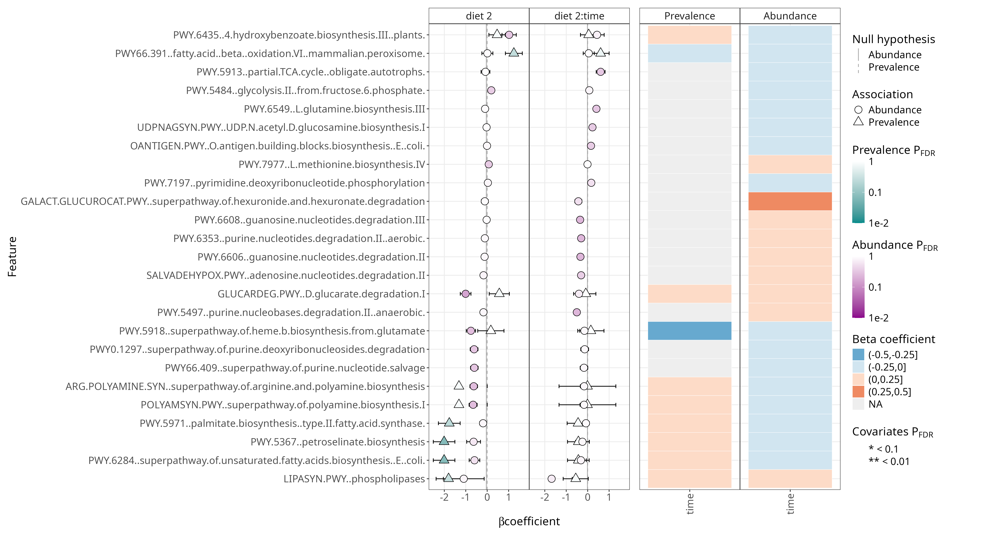
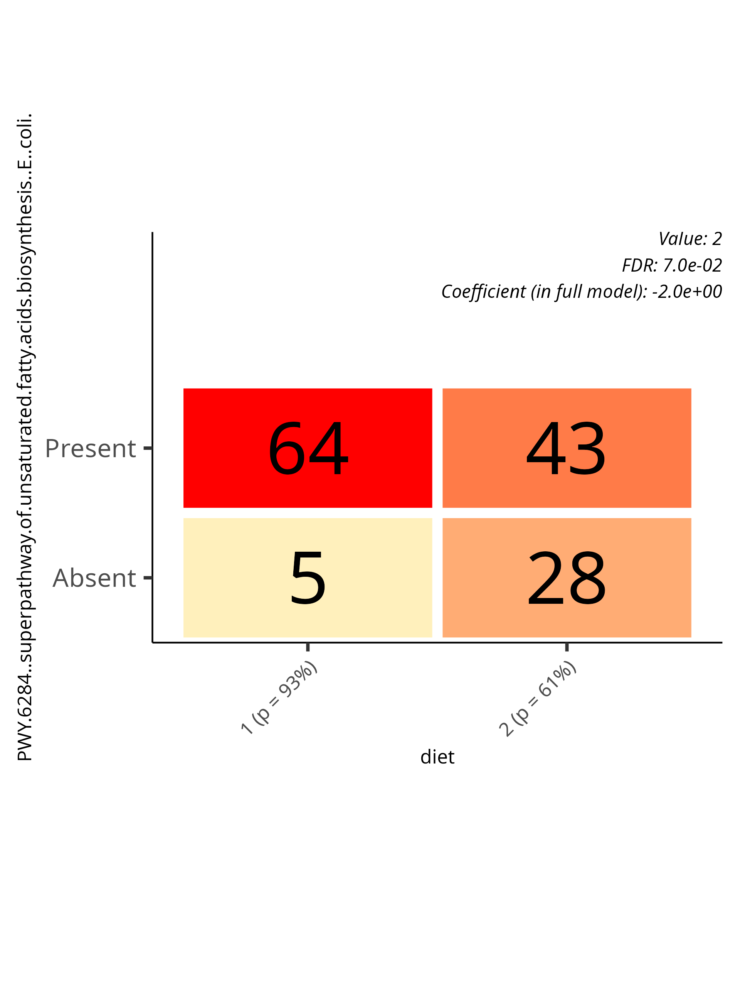

### Differential abundance analysis

```{r setup}
library(maaslin3)

# Source group-assignment
source("funct.R")

# Load the TreeSummarizedExperiment object
tse <- readRDS("../data/tse.Rds")

path_tse <- altExp(tse, "pathabundance")

variable <- "diet" 
formula_used <- "~ diet * time"
```

-   Group variable: **`r variable`**
-   Formula used: **`r formula_used`**

```{r data_prep}
# Create output directory for results
output_base_dir <- "../output/daa_maaslin3"
dir.create(output_base_dir, showWarnings = FALSE)
```

```{r maaslin all}
# Extract unique diets from path_tse$diet
# unique_diets <- sort(unique(path_tse$diet))
# 
# # Run Maaslin3 for each diet and save results
# results <- lapply(unique_diets, function(diet) {
#   # Subset path_tse for the current diet
#   diet_tse <- path_tse[, path_tse$diet == diet]
#   
#   # Define the output directory for the current diet
#   diet_output_dir <- file.path(output_base_dir, paste0("diet_", diet))
#   dir.create(diet_output_dir, showWarnings = FALSE)
#   
  # Run Maaslin3
  # fit_out <- maaslin3(
  #   path_tse,
  #   output = output_base_dir,
  #   formula = '~ diet * time',
  #   normalization = 'TSS',
  #   transform = 'LOG',
  #   augment = TRUE,
  #   standardize = TRUE,
  #   max_significance = 0.1,
  #   median_comparison_abundance = TRUE,
  #   median_comparison_prevalence = FALSE,
  #   max_pngs = 100,
  #   cores = 1,
  #   save_models = TRUE,
  #   verbosity = "WARN"
  # )
# })
```

```{r print_table}
#| label: table-of-significant-results
daa_tab <- read_tsv("../output/daa_maaslin3/significant_results.tsv", col_names = TRUE)
daa_tab <- daa_tab %>%
              select(feature, metadata, value, coef, qval_individual, qval_joint, model)
if (knitr::is_html_output()) {
  datatable(
      daa_tab,
      options = list(
        pageLength = 6,
        dom = 'Bfrtip'
      ),
      caption = "Table of significant features",
      rownames = FALSE
  ) %>%
    formatSignif(columns = c("qval_joint"), digits = 3)
} else {
  library(kableExtra)
  daa_tab %>% 
    mutate(
      across(where(is.numeric), ~round(., 3)),
      feature = ifelse(nchar(feature) > 8, 
                     paste0(substr(feature, 1, 8), "..."), 
                     feature)
      #p.adj = signif(p.adj, 3)
    ) %>%
    kbl(caption = "Table of significant features",
        booktabs = TRUE,
        longtable = TRUE,
        align = c('l', 'r', 'r', 'r', 'r', 'r', 'r')) %>%
    kable_styling(latex_options = "repeat_header") %>%
    row_spec(0, bold = TRUE)
}

```

```{r print results}
png_files <- list.files(output_base_dir, pattern = "\\.png$", full.names = TRUE, recursive = TRUE)
```

  
